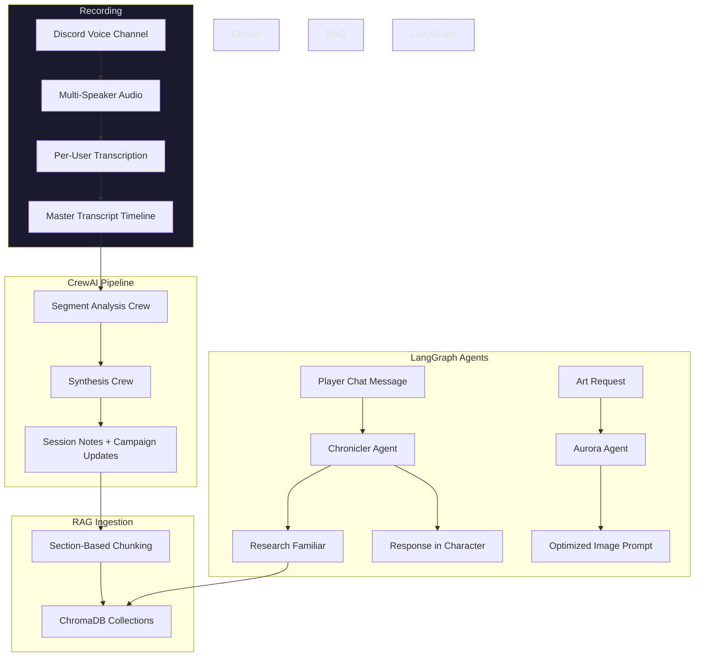

# AI Agent Architecture Showcase

**Production-tested AI agent patterns from a live Discord bot serving tabletop RPG communities.**

> **Note: This is a showcase repository.** The code here is extracted and sanitized from a larger private codebase. It is not runnable on its own — it exists to demonstrate architecture, design patterns, and multi-agent orchestration in a real production system.

---

## About The Chronicler

The Chronicler is a production Discord bot built for tabletop RPG groups. It joins voice channels to record play sessions, transcribes multi-speaker audio, and generates structured session notes using AI agent pipelines. Players can also chat with an in-character AI that has deep knowledge of their campaign history through retrieval-augmented generation.

The system processes real sessions with 4-6 concurrent speakers, handles hours-long recordings, and delivers polished narrative notes — all orchestrated by the agent architectures showcased here.

## What This Showcases

This repository highlights nine key patterns for building production AI agent systems:

| Pattern | Description |
|---------|-------------|
| **CrewAI Flow State Machine** | Two-phase pipeline using `@start` / `@listen` decorators to move transcripts through segmentation, analysis, and synthesis |
| **Per-Role LLM Overrides** | Route different agent roles to different LLM providers — use a cheaper model for extraction, a stronger model for synthesis |
| **Three-Tier LLM Fallback** | Primary provider with timeout and retry, then automatic switchover to a backup provider for resilience |
| **Agent-as-Tool Pattern** | A compiled LangGraph agent (the Research Familiar) wrapped as a LangChain `StructuredTool`, invocable by other agents |
| **Multi-Provider LLM Factory** | Unified interface across Anthropic, OpenAI, Google Gemini, XAI Grok, and Vertex AI via LiteLLM |
| **Content-Aware RAG** | Three ChromaDB collections per campaign with tuned chunk sizes — narratives (600 tokens), details (400), transcripts (300) |
| **Smart Context Caching** | Campaign data cached with TTL to avoid redundant loads on rapid successive chat messages |
| **Sliding Window Retention** | Checkpoint database kept manageable by trimming older conversation history while preserving recent context |
| **YAML-Driven Agent Configuration** | Agent personalities, backstories, and task definitions fully externalized to YAML files |

## High-Level Architecture

## Repository Structure

### [`crewai-pipelines/`](./crewai-pipelines/)

The CrewAI session processing system. A `Flow` state machine orchestrates two specialized crews through a segmented transcript analysis pipeline. Includes YAML-driven agent/task configuration, per-role LLM overrides, and custom tools for campaign data updates.

Key files: flow orchestrator, segment analysis crew, synthesis crew, LLM settings with fallback logic, and YAML configs for agents and tasks.

### [`langgraph-agents/`](./langgraph-agents/)

Three LangGraph conversational agents built with `create_react_agent`:

- **The Chronicler** — An in-character campaign assistant that answers player questions using RAG-backed campaign knowledge. Features smart context caching and sliding window checkpoint management.
- **Research Familiar (Quoth)** — A RAG retrieval agent compiled and wrapped as a `StructuredTool`, callable by other agents. Searches across three campaign-specific ChromaDB collections.
- **Aurora** — An art prompt optimization agent that adapts character appearances to scene context using tool-based reasoning.

### [`rag-system/`](./rag-system/)

The campaign-specific RAG pipeline. Content is parsed by section, chunked by token count with type-aware sizing, embedded via OpenAI, and indexed into campaign-scoped ChromaDB collections. The agent decides which collection(s) to search based on query type.

### [`docs/`](./docs/)

Architecture diagrams and design pattern documentation.

## Technology Stack

- **Agent Frameworks**: CrewAI (crews, flows, tools), LangGraph / LangChain
- **LLM Providers**: Anthropic Claude, OpenAI GPT, Google Gemini, XAI Grok, Vertex AI (via LiteLLM)
- **Vector Database**: ChromaDB with OpenAI embeddings
- **Data Validation**: Pydantic v2
- **Async Runtime**: Python asyncio
- **Configuration**: YAML agent definitions, JSON LLM settings

## Design Decisions Worth Noting

**Why three separate ChromaDB collections per campaign?** Different content types have different optimal chunk sizes. Narrative prose benefits from larger chunks (600 tokens) that preserve story flow. Mechanical details like stats and rules work better as focused smaller chunks (400 tokens). Raw transcript dialogue needs tight chunks (300 tokens) to isolate individual exchanges.

**Why wrap a LangGraph agent as a tool?** The Research Familiar needs to be callable by multiple parent agents (Chronicler chat, Aurora art, session processing). Compiling it into a `StructuredTool` gives a clean interface — the parent agent decides *when* to search campaign knowledge, and the Research Familiar decides *how*.

**Why per-role LLM overrides?** Not every agent task needs the most capable (and expensive) model. Extraction and formatting tasks run well on faster, cheaper models. Synthesis and creative tasks benefit from stronger reasoning. Per-role routing cuts costs significantly without sacrificing output quality where it matters.

---

*Architecture from a production system serving tabletop RPG communities.*
