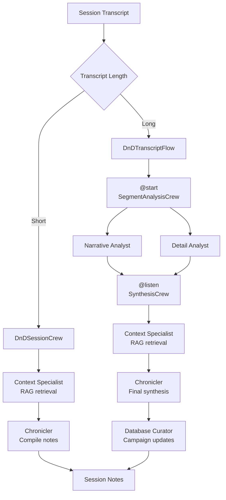

# CrewAI Pipelines

Production CrewAI crews that transform raw TTRPG session transcripts into structured, entertaining session notes. These crews power the Chronicler Discord bot's core feature: automated note-taking for tabletop roleplaying sessions.

## Two Processing Paths

The system chooses between two paths based on transcript length:

**Short sessions** use `session_crew.py` -- a single `@CrewBase` crew with two agents (context specialist + chronicler) that processes the transcript in one pass.

**Long sessions** use `transcript_flow.py` -- a multi-phase `Flow` state machine that splits the transcript into segments, analyzes them in parallel, then synthesizes everything into final notes.



## Per-Role LLM Overrides

Not every agent needs the same model. A context specialist doing vector search can use a cheaper model, while the chronicler synthesizing prose benefits from a premium one. The config in `config/notes_llm_config.json` defines primary and backup providers plus per-role overrides:

```json
{
  "primary": { "provider": "anthropic", "model": "claude-haiku-4-5" },
  "backup":  { "provider": "xai", "model": "grok-4-1-fast" },
  "role_overrides": {
    "context_specialist": "backup",
    "narrative_analyst": "backup",
    "detail_analyst": "backup"
  }
}
```

At runtime, every crew's `@before_kickoff` hook builds a reverse map from YAML role text to config key, then calls `get_llm_for_role()` to assign the correct LLM to each agent. See `session_crew.py` lines 33-62 and `llm_config.py` lines 299-325 for the implementation.

## Three-Tier Fallback Strategy

The `with_llm_fallback()` wrapper in `llm_config.py` (lines 462-535) implements a retry strategy for every crew execution:

1. **Primary attempt** -- run the crew with the current LLM
2. **Wait and retry** -- if the provider returns an error (rate limit, overload), wait 60 seconds and retry with a fresh crew instance
3. **Switch to backup** -- if the primary fails again, switch `current_mode` to `"backup"` and create a new crew, which picks up the backup LLM via `@before_kickoff`

Each retry creates a fresh crew instance so that `@before_kickoff` re-reads the config file and re-assigns LLMs. The provider detection in `should_switch_to_backup()` catches errors from Anthropic, Gemini, Vertex AI, XAI/Grok, and Google.

## YAML-Driven Agent Configuration

Agent personalities and task specifications live in YAML files under `config/`, keeping prompt engineering separate from Python logic. CrewAI's `@CrewBase` decorator loads these automatically:

| File | Purpose |
|------|---------|
| `segment_agents.yaml` | Narrative analyst and detail analyst personas |
| `segment_tasks.yaml` | Per-segment analysis templates with `{transcript}`, `{context}`, `{segment_index}` placeholders |
| `synthesis_agents.yaml` | Chronicler, context specialist, and database curator personas |
| `synthesis_tasks.yaml` | Synthesis phase task templates including a full example of excellent session notes |
| `short_session_tasks.yaml` | Simplified task templates for the single-crew path |

The agents are given distinct D&D-flavored backstories. The narrative analyst is a "veteran game master" tracking plot and social dynamics. The detail analyst is a "meticulous rules expert" tracking mechanics and loot. The chronicler writes in the voice of Brennan Lee Mulligan or Matt Mercer, complete with wit and the occasional quip.

## Parallel Segment Processing

For long sessions, `SegmentAnalysisCrew.process_all_segments()` (in `segment_analysis_crew.py` lines 103-198) builds an array of per-segment inputs and calls `kickoff_for_each()` -- CrewAI's built-in parallel execution. Each segment gets its own crew run with both a narrative analyst and a detail analyst. Token usage is aggregated across all parallel segments for accurate cost tracking.

## Tool Architecture

The `tools/` directory contains four CrewAI `BaseTool` implementations that give the Database Curator agent write access to campaign XML databases:

| Tool | Entity Types | Operations |
|------|-------------|------------|
| `pc_update_tool.py` | Player Characters | create, update, delete, add_item, remove_item, add_relationship |
| `npc_update_tool.py` | NPCs | create, update, delete, add_connection, update_status, update_location |
| `campaign_update_tool.py` | Locations, Factions, Quests, World | create, update, delete |
| `xml_update_tool.py` | All entity types (unified interface) | add, modify, delete |

Each tool uses Pydantic `BaseModel` schemas with validators as its `args_schema`, defining the contract between AI agents and the database layer. For example, `NPCUpdateInput` validates that `npc_id` is provided for non-create operations and that `connection_text` is present for connection operations. This prevents agents from making malformed database calls.
