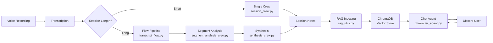
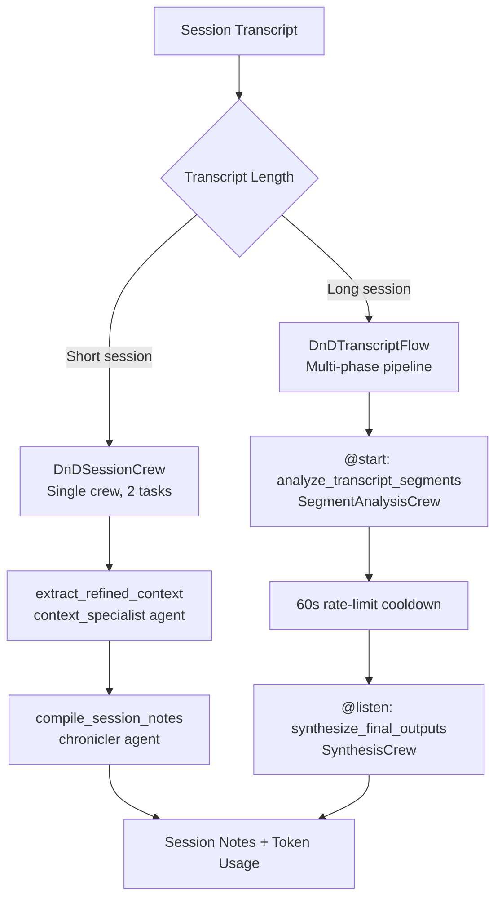
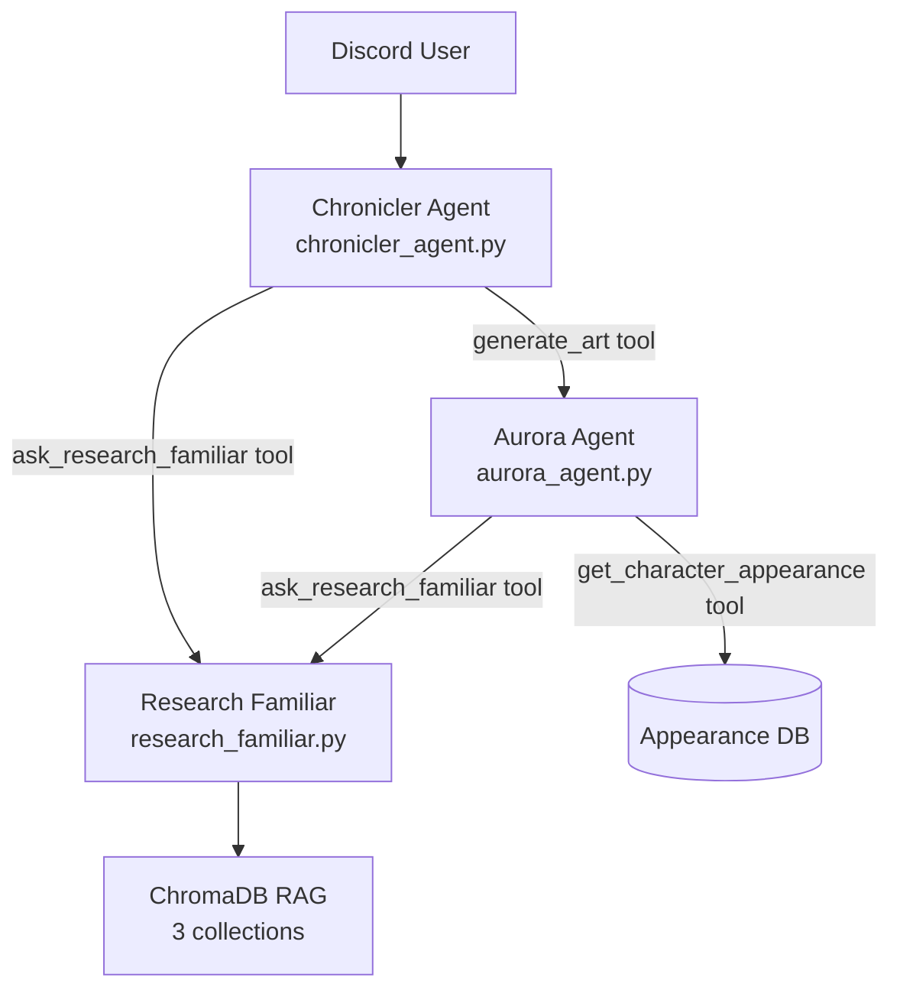

# System Architecture

This document describes the architecture of the DnD Chronicler AI agent system -- a production Discord bot that records tabletop RPG sessions, generates structured session notes, and provides an interactive AI chat experience for players.

The system uses two AI agent frameworks (CrewAI and LangGraph) alongside a shared RAG knowledge layer, each chosen for the specific problem it solves best.

---

## High-Level Architecture

The system comprises three subsystems:

| Subsystem | Framework | Purpose | Interaction Model |
|-----------|-----------|---------|-------------------|
| **CrewAI Pipelines** | CrewAI | Batch session processing | Fire-and-forget, async |
| **LangGraph Agents** | LangGraph | Interactive Discord chat | Request-response, real-time |
| **RAG System** | ChromaDB + OpenAI Embeddings | Shared campaign knowledge | Query layer for both subsystems |

### Why Two Frameworks?

**CrewAI** excels at multi-agent batch workflows where specialized agents collaborate sequentially on a large document (a session transcript). Its `@CrewBase` decorator system, YAML-driven agent configuration, and `Flow` state machine provide clean orchestration for pipelines that run unattended for several minutes.

**LangGraph** excels at interactive, tool-using agents that maintain conversation state across turns. Its `create_react_agent` pattern, checkpointer-backed memory, and native async support are ideal for a Discord chat agent that must respond in seconds while invoking nested sub-agents as tools.

The RAG system bridges both: CrewAI crews index content after processing, and LangGraph agents query it during conversation.

### End-to-End Data Flow



---

## Processing Pipeline (CrewAI)

Session transcripts are processed through one of two paths depending on length.

### Two Processing Paths



**Short sessions** use `DnDSessionCrew` (`crewai-pipelines/session_crew.py`), a single `@CrewBase` crew with two sequential tasks: context retrieval followed by notes compilation.

**Long sessions** use `DnDTranscriptFlow` (`crewai-pipelines/transcript_flow.py`), a CrewAI `Flow` state machine that coordinates two phases with an explicit rate-limit pause between them.

### Flow State Machine

The `DnDTranscriptFlow` class extends `Flow[TranscriptFlowState]` where `TranscriptFlowState` is a Pydantic model that tracks progress across phases:

```python
class TranscriptFlowState(BaseModel):
    analysis_complete: bool = False
    synthesis_complete: bool = False
    narrative_path: str = ""
    detail_path: str = ""
    session_notes: str = ""
    segment_input_tokens: int = 0
    segment_output_tokens: int = 0
    synthesis_input_tokens: int = 0
    synthesis_output_tokens: int = 0
```

The `@start` decorator marks `analyze_transcript_segments` as the entry point. The `@listen(analyze_transcript_segments)` decorator on `synthesize_final_outputs` creates a dependency edge -- synthesis only runs after analysis completes. CrewAI Flow manages this dependency graph automatically.

### Segment Analysis Phase

`SegmentAnalysisCrew` (`crewai-pipelines/segment_analysis_crew.py`) uses CrewAI's `kickoff_for_each()` to process transcript segments in parallel. Each segment is analyzed by two specialized agents:

- **narrative_analyst** -- Story progression, character development, social interactions
- **detail_analyst** -- Game mechanics, combat specifics, treasure, location descriptions

Both agents are defined in `crewai-pipelines/config/segment_agents.yaml` with task templates in `crewai-pipelines/config/segment_tasks.yaml`.

### Token Usage Accumulation

Token usage is tracked across both phases for cost monitoring. Each crew result exposes a `token_usage` attribute (CrewAI >= 0.100) with `prompt_tokens` and `completion_tokens`. The flow state accumulates these:

1. **Segment analysis phase** -- aggregates token counts across all parallel segment runs into `segment_input_tokens` / `segment_output_tokens`
2. **Synthesis phase** -- captures its own counts into `synthesis_input_tokens` / `synthesis_output_tokens`
3. **process_session()** -- sums both phases into a single `token_usage` dict returned to the caller

This ensures accurate cost attribution regardless of how many segments were processed or whether primary or backup LLMs were used.

---

## Conversational Agents (LangGraph)

Three LangGraph agents handle real-time Discord interactions. They compose through the **Agent-as-Tool** pattern, where compiled sub-agents are wrapped as LangChain `StructuredTool` instances.

### Agent Composition



### The Three Agents

**Chronicler** (`langgraph-agents/chronicler_agent.py`) -- The main conversational agent. An in-character "elderly archivist" that answers player questions about their campaign using pre-loaded context and tool calls. Built with `create_react_agent`, it receives the Research Familiar (and optionally Aurora) as tools.

**Research Familiar** (`langgraph-agents/research_familiar.py`) -- A focused RAG research agent exposed to the Chronicler as the `ask_research_familiar` tool. It searches three ChromaDB collections (narratives, details, transcripts) with lower temperature (0.5) and smaller token budget (300) for factual, citation-rich responses.

**Aurora** (`langgraph-agents/aurora_agent.py`) -- An art director agent that crafts optimized image generation prompts using character appearance context. Uses Nanobanana prompt structure (Subject, Action, Location, Style, Details) and a three-tier character description fallback: database lookup, Research Familiar query, then scene description only.

### Agent-as-Tool Pattern

The Research Familiar demonstrates this pattern clearly. Rather than invoking the sub-agent directly, the Chronicler calls it through a `StructuredTool`:

1. `create_familiar_graph()` builds a compiled `StateGraph` containing the Familiar agent as a single node
2. `create_familiar_tool()` wraps the compiled graph's `ainvoke()` in an async function
3. `StructuredTool.from_function(coroutine=...)` exposes the async function as a tool the Chronicler can call

The compiled graph approach solves async/sync boundary issues that occur when nesting LangGraph agents. Using `coroutine=` on `StructuredTool.from_function` ensures only the async path is used, avoiding event loop conflicts.

### Conversation State

The `ChroniclerState` TypedDict (`langgraph-agents/graph_state.py`) defines the state schema persisted by LangGraph's SQLite checkpointer at every node:

- `messages` -- Conversation history with `add_messages` reducer for automatic deduplication
- `campaign_context` -- Pre-loaded campaign data (NPCs, PCs, locations, quests, factions)
- `campaign_context_loaded_at` -- ISO timestamp for staleness detection
- `campaign_context_for_campaign_id` -- Detects campaign switches requiring context reload
- `guild_id` / `campaign_id` -- Identity tracking

---

## Shared Infrastructure

### RAG System

The RAG layer (`rag-system/rag_utils.py`) provides campaign-specific vector search using ChromaDB with OpenAI `text-embedding-3-large` embeddings. Each campaign gets three collections with content-aware chunk sizes:

| Collection | Chunk Size | Overlap | Optimized For |
|-----------|-----------|---------|---------------|
| `campaign_{id}_narratives` | 600 tokens | 100 | Story flow, character arcs |
| `campaign_{id}_details` | 400 tokens | 80 | Mechanics, stats, locations |
| `campaign_{id}_transcripts` | 300 tokens | 60 | Precise dialogue matching |

The bridge layer (`rag-system/rag_tool_wrappers.py`) wraps CrewAI `RagTool` instances as LangChain `@tool` functions, enabling both frameworks to share the same vector database backend.

### Multi-Provider LLM Configuration

Two separate configuration systems serve the two frameworks:

**Batch processing** (`crewai-pipelines/llm_config.py`) produces CrewAI `LLM` instances from `notes_llm_config.json`. Supports five providers: Anthropic, OpenAI, Google (Gemini), XAI (Grok), and Vertex AI. Features per-role overrides (e.g., cheaper models for context retrieval, premium for synthesis) and a three-tier fallback strategy.

**Interactive chat** (`langgraph-agents/chat_llm_config.py`) produces LangChain `BaseChatModel` instances from `chat_llm_config.json`. Same provider support but uses LangChain-native classes (`ChatAnthropic`, `ChatOpenAI`, `ChatXAI`, etc.) with different parameter conventions.

The architectural choice to maintain separate configs is deliberate: CrewAI and LangChain have different model interfaces, and batch processing benefits from different model/temperature choices than real-time conversation.

### Cost Tracking

Token usage flows from every agent interaction back to a centralized cost logger:

- **CrewAI crews** -- `result.token_usage` extracted after each `kickoff()`, accumulated across segments in the Flow state
- **LangGraph agents** -- `AIMessage.usage_metadata` scanned on new messages only (skipping historical messages to avoid double-counting)
- **Aurora agent** -- Token usage extracted from response messages and returned alongside the generated prompt
