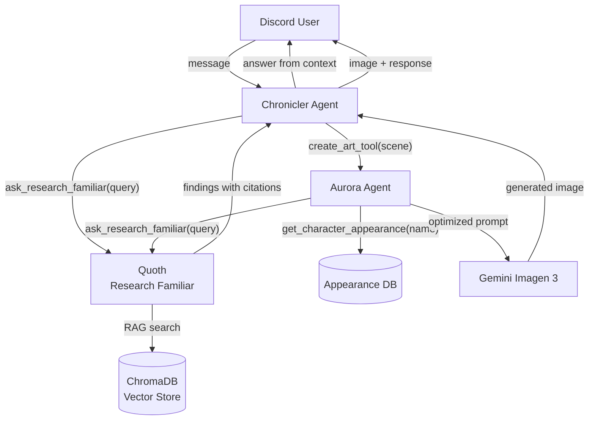

# LangGraph Agents

Three LangGraph-based conversational AI agents that power the Chronicler Discord bot's interactive features. Unlike the CrewAI pipelines (which handle batch processing of session transcripts), these agents operate in real-time, responding to player messages in Discord chat.

## The Three Agents

**The Chronicler** (`chronicler_agent.py`) is the primary chat agent -- an in-character elderly archivist who helps TTRPG players query campaign records, request art, and correct session notes. Built with `create_react_agent`, it speaks with the personality of a seasoned GM: witty, knowledgeable, and occasionally snarky. It delegates specialized tasks to the other two agents.

**Quoth the Research Familiar** (`research_familiar.py`) is a RAG-specialized research agent. When the Chronicler cannot answer a question from its pre-loaded campaign context, it dispatches Quoth to search three vector database collections (narratives, details, transcripts). Quoth runs at lower temperature (0.5) and a smaller token budget (300) for focused, factual research.

**Aurora** (`aurora_agent.py`) is the art director agent. When players request scene or character art, Aurora crafts optimized image generation prompts using the Nanobanana structure (Subject, Action, Location, Style, Details). Aurora solves the "armor vs pajamas" problem -- rather than blindly pasting a character's stored appearance into every prompt, it reasons about scene context and adapts gear, pose, and expression accordingly.

## Agent Interaction

## The Agent-as-Tool Pattern

The core architectural pattern here is wrapping a compiled LangGraph agent as a LangChain `StructuredTool`. This is how the Chronicler invokes Quoth: not as a direct function call, but as a tool that LangGraph manages within its message loop.

The implementation in `research_familiar.py` (lines 252-445) works in three steps:

1. **Build a compiled graph** -- `create_familiar_graph()` creates a `StateGraph` with a single node containing the Familiar agent, then calls `.compile()` to produce a runnable
2. **Wrap in an async tool** -- `create_familiar_tool()` creates an async closure that invokes the compiled graph via `.ainvoke()` and extracts the final AI message
3. **Register as StructuredTool** -- `StructuredTool.from_function(coroutine=...)` exposes the async closure as a tool the Chronicler can call

This compiled-graph approach solves the async/sync boundary issues that arise when nesting LangGraph agents. A direct `await agent.ainvoke()` inside a synchronous tool would fail; the compiled graph handles the invocation boundary cleanly.

Aurora uses the same pattern to access Quoth -- it receives `create_familiar_tool()` as one of its tools, creating a chain where the Chronicler calls Aurora, and Aurora can call Quoth if character appearance data is missing.

## Smart Context Caching

The Chronicler avoids reloading campaign XML data on every message. In `chronicler_agent.py` (lines 454-508), the `chronicler_node` implements a staleness check:

- **Campaign mismatch** -- if the stored `campaign_context_for_campaign_id` differs from the current request, reload immediately (catches campaign switches)
- **Missing timestamp** -- if no `campaign_context_loaded_at` exists, load fresh
- **Staleness threshold** -- if context is older than 1 minute, reload; otherwise reuse

This means rapid-fire messages in Discord reuse the same context, while a pause between messages triggers a fresh load. The `ContextBuilder` class (`context_builder.py`) handles the actual XML parsing.

## Sliding Window Retention

To keep the SQLite checkpoint database manageable, the Chronicler trims conversation history to the last 20 messages after each invocation (`chronicler_agent.py` lines 554-558). Older messages are discarded. Combined with the `Base64StrippingSerializer` (`checkpoint_serializer.py`), which replaces inline images with `"[image stripped for storage]"` placeholders before persistence, this prevents unbounded storage growth from long conversations and image uploads.

## State Schema

The `ChroniclerState` TypedDict (`graph_state.py`) defines everything LangGraph persists across turns:

| Field | Type | Purpose |
|-------|------|---------|
| `messages` | `Annotated[List[BaseMessage], add_messages]` | Conversation history with automatic deduplication |
| `campaign_context` | `Dict` | Pre-loaded NPCs, PCs, locations, quests, factions |
| `campaign_context_loaded_at` | `str` | ISO 8601 timestamp for staleness detection |
| `campaign_context_for_campaign_id` | `Optional[str]` | Detects campaign switches |
| `guild_id` / `campaign_id` | `int` / `str` | Identity tracking |
| `attachment_path` | `Optional[str]` | Set by art generation for Discord file attachment |
| `repost_session_id` | `Optional[str]` | Triggers notes reposting after edits |

## Multi-Provider LLM Configuration

The `chat_llm_config.py` module produces LangChain `BaseChatModel` instances (as opposed to `llm_config.py` in the CrewAI pipelines, which produces CrewAI `LLM` instances). The two configs are intentionally separate because CrewAI and LangChain have different model interfaces and parameter conventions.

Supported providers: Anthropic (`ChatAnthropic`), OpenAI (`ChatOpenAI`), Google Gemini (`ChatGoogleGenerativeAI`), Vertex AI (`ChatVertexAI`), and XAI/Grok (`ChatXAI`). Configuration lives in `chat_llm_config.json` with primary/backup profiles. If the primary provider fails to initialize, `get_chronicler_llm()` automatically attempts the backup.

## Character Appearance Schema

The `schemas.py` module defines a 7-section Pydantic model (`CharacterAppearance`) for structured character visual data:

1. **IdentityAnchors** -- species, build, skin tone, silhouette (always included)
2. **FaceHead** -- facial structure, scars, ears
3. **Eyes** -- color, shape, soft vibe tags (e.g., "mischievous", "haunted")
4. **Hair** -- color, texture, signature details
5. **BodyDetails** -- tattoos, fantasy features (horns, tails), magical aura
6. **GearOutfit** -- clothing style, color palette, equipment with materials
7. **PersonalityPresence** -- core vibe, posture, default expression

The `to_prompt_string()` method converts this structured data into natural language for image generation models. Aurora reads these models and adapts them to scene context -- physical features are always included, but gear and pose change based on the scene description.
