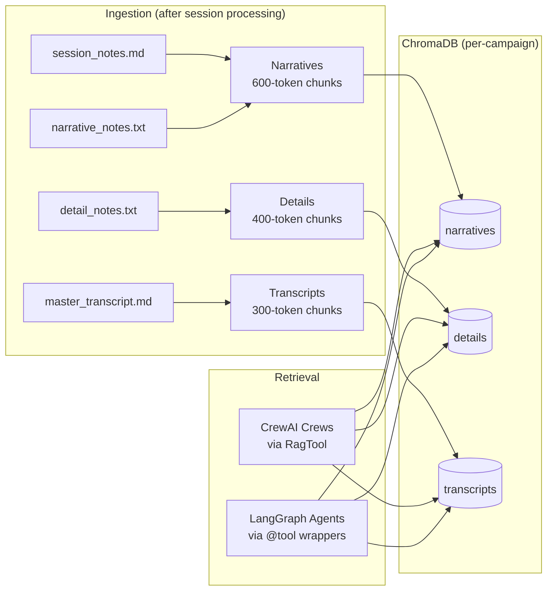

# RAG System

Campaign-specific Retrieval Augmented Generation system using ChromaDB. This is the shared knowledge layer that serves both the CrewAI pipelines (batch session processing) and the LangGraph agents (interactive chat), providing vector search over session transcripts, narrative analyses, and detailed notes.

## Three-Collection Architecture

Each campaign gets three separate ChromaDB collections, each tuned for its content type:

| Collection | Chunk Size | Overlap | Content | Why This Size |
|------------|-----------|---------|---------|---------------|
| `campaign_{id}_narratives` | 600 tokens | 100 | Story analyses, character arcs, plot threads | Larger chunks preserve narrative flow across paragraph boundaries |
| `campaign_{id}_details` | 400 tokens | 80 | Mechanics, items, locations, combat stats | Medium chunks balance precision with enough context for multi-line descriptions |
| `campaign_{id}_transcripts` | 300 tokens | 60 | Raw dialogue with timestamps | Smaller chunks match individual speaker turns for precise quote retrieval |

The chunk size rationale is straightforward: narrative content loses coherence when split too finely (a character arc spanning two paragraphs should stay together), while transcript dialogue is naturally short (individual speaker turns) and benefits from tight chunks that match against specific quotes.

All three collections use OpenAI's `text-embedding-3-large` model for embeddings.



## Campaign Isolation

Every campaign gets its own ChromaDB directory at `chronicler_data/guilds/{guild_id}/campaigns/{campaign_id}/chroma/`. A single Discord server running multiple campaigns will never have search results bleed between them.

Collection names are derived from campaign IDs, which can contain unicode characters (accented names from non-English campaigns). The `_sanitize_collection_name()` function in `rag_utils.py` (lines 24-74) normalizes unicode to ASCII, replaces invalid characters, and enforces ChromaDB's naming constraints (3-63 alphanumeric characters, no consecutive periods, no IPv4 addresses). As a last resort, it falls back to an MD5 hash of the original ID.

## Dual Tool Interface

The same ChromaDB backend is consumed through two different tool interfaces, because CrewAI and LangChain have incompatible tool contracts:

**CrewAI RagTool** (`rag_utils.py`) -- The `create_campaign_rag_tools()` function builds three `RagTool` instances with campaign-specific ChromaDB clients injected via adapter monkey-patching (`tool.adapter._client = wrapped_client`). These are consumed directly by CrewAI crews during batch session processing. Each tool gets a detailed description with query examples, search parameter guidance, and expected output format to help agents craft effective searches.

**LangChain @tool wrappers** (`rag_tool_wrappers.py`) -- The `create_langchain_rag_tools()` function wraps the CrewAI RagTools as LangChain-compatible tools using the `@tool` decorator. Each wrapper captures a CrewAI RagTool via closure and delegates to its `_run()` method. This bridge layer is what enables the Research Familiar (Quoth) in the LangGraph agent system to search the same vector databases that the CrewAI crews populate.

The wrapping pattern in `rag_tool_wrappers.py` (lines 54-177) looks like this for each collection:

```python
@tool
def campaign_narrative_search(query: str, similarity_threshold: float = 0.5, limit: int = 5) -> str:
    """Search narrative session notes..."""
    result = narratives_rag._run(query=query, similarity_threshold=similarity_threshold, limit=limit)
    return result
```

Each wrapper exposes `similarity_threshold` and `limit` as tunable parameters, with per-collection defaults (transcripts default to 0.4 threshold due to speech-to-text variation, while narratives and details default to 0.5).

## Indexing Pipeline

The `index_session_content()` function in `rag_utils.py` (lines 360-440) indexes session output files after CrewAI processing completes. Each file gets a metadata header injected with session ID and date before indexing:

- `narrative_notes.txt` goes to the narratives collection
- `detail_notes.txt` goes to the details collection
- `session_notes.md` goes to both narratives and details (it contains both story and factual content)
- `master_transcript.md` goes to the transcripts collection

Metadata tags (session_id, campaign_id, source file) are attached to every indexed chunk, enabling future filtering and provenance tracking.
